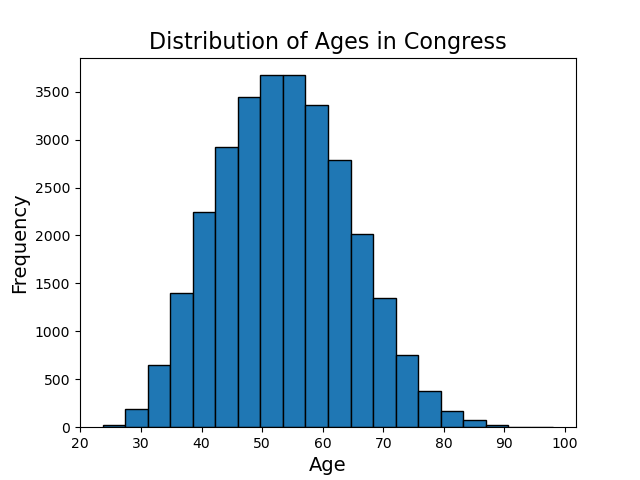

# Jenny_Wu_MP2_F24
F24 Mini Project 3

### Purpose of Project
The goal of this project is to utilize the polars library to create summary statistics and a visualization for a selected data set. To find the file that conducts the descriptive statistic, please see the "lib.py" file or the "Congressional Age.ipynb". Moreover, you can find the Markdown print out in the "summary_stats.d" file. 

### Requirements:
 - Python script using Polars for descriptive statistics
 - Read a dataset (CSV or Excel)
 - Generate summary statistics (mean, median, standard deviation)
 - Create at least one data visualization
 - Python script
 - CI/CD with badge
 - Generated summary report (PDF or markdown) via CI/CD for extra credit or making your own PDF or MD file and pushing it

 ### Project Organization 
    .dev container
    - devcontainter.json
    - Dockerfile
    .github 
        workflows
            - CICD.yml
    output
        - congressional_age.png
    - desc_stats_main.py
    - lib.py
    - test_desc_stats_main.py
    - test_lib.py
    - summary_stats.md
    Congressional Age.ipynb
    Makefile
    README.md
    requirements.txt